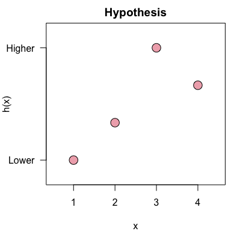
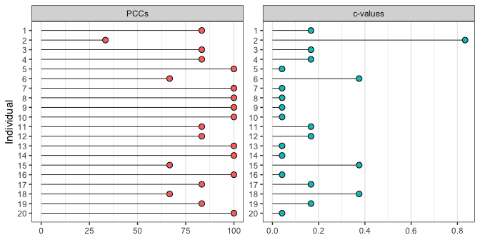
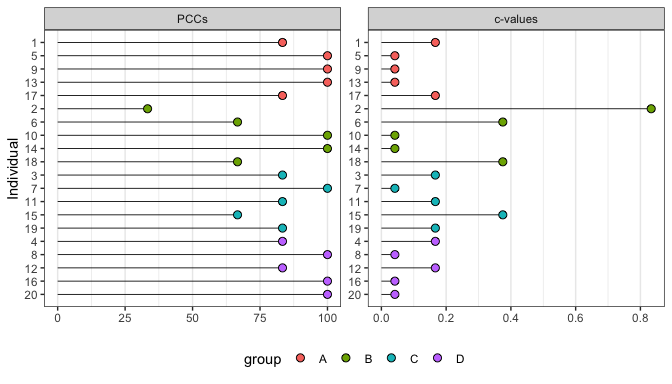

<!-- README.md is generated from README.Rmd. Please edit that file -->

# opa

<!-- badges: start -->


<!-- badges: end -->

An R package for ordinal pattern analysis.

## Installation

opa can be installed from CRAN with:

``` r
install.packages("opa")
```

You can install the development version of opa from
[GitHub](https://github.com/) with:

``` r
# install.packages("devtools")
devtools::install_github("timbeechey/opa")
```

## Citation

To cite opa in your work you can use the output of:

``` r
citation(package = "opa")
```

## How ordinal pattern analysis works

Ordinal pattern analysis is similar to Kendall’s Tau. Whereas Kendall’s
tau is a measure of similarity between two data sets in terms of rank
ordering, ordinal pattern analysis is intended to quantify the match
between an hypothesis and patterns of individual-level data across
conditions or mesaurement instances.

Ordinal pattern analysis works by comparing the relative ordering of
pairs of observations and computing whether these pairwise relations are
matched by an hypothesis. Each pairwise ordered relation is classified
as an increases, a decrease, or as no change. These classifications are
encoded as 1, -1 and 0, respectively. An hypothesis of a monotonic
increase in the response variable across four experimental conditions
can be specified as:

``` r
h <- c(1, 2, 3, 4)
```

The hypothesis `h` encodes six pairwise relations, all increases:
`1 1 1 1 1 1`.

A row of individual data representing measurements across four
conditions, such as:

``` r
dat <- c(65.3, 68.8, 67.0, 73.1)
```

encodes the ordered pairwise relations `1 1 1 -1 1 1`. The percentage of
orderings which are correctly classified by the hypothesis (PCC) is the
main quantity of iterest in ordinal pattern analysis. Comparing `h` and
`dat`, the PCC is `5/6 = 0.833` or 83.3%. An hypothesis which generates
a greater PCC is preferred over an hypothesis which generates a lower
PCC for given data.

It is also possible to calculate a chance-value for a PCC which is equal
to the chance that a PCC at least as great as the PCC of the observed
data could occur as a result of a random ordering of the data. Chance
values can be computed using either a permutation test or a
randomization test.

## Using `opa`

``` r
library(opa)
```

A hypothesized relative ordering of the response variable across
conditions is specified with a numeric vector:

``` r
h <- c(1, 2, 4, 3)
```

The hypothesis can be visualized with the `plot_hypothesis()` function:

``` r
plot_hypothesis(h)
```



Data should be in *wide* format with one column per measurement
condition and one row per individual:

``` r
dat <- data.frame(t1 = rnorm(20, mean = 12, sd = 2),
                  t2 = rnorm(20, mean = 15, sd = 2),
                  t3 = rnorm(20, mean = 20, sd = 2),
                  t4 = rnorm(20, mean = 17, sd = 2))
                  
round(dat, 2)
#>       t1    t2    t3    t4
#> 1  12.43 16.39 21.53 14.82
#> 2  15.53 15.64 15.17 12.37
#> 3  13.65 14.98 20.52 13.99
#> 4  13.57 16.42 20.86 15.72
#> 5  13.78 14.06 19.75 15.97
#> 6  15.49 12.33 18.99 13.29
#> 7  12.25 17.65 19.95 17.98
#> 8  10.79 17.26 23.43 18.16
#> 9   6.07 12.65 20.89 17.49
#> 10 10.36 12.70 18.33 17.95
#> 11 11.54 16.29 21.32 14.61
#> 12  8.75 14.91 21.72 14.40
#> 13 13.50 14.65 19.72 17.39
#> 14  7.71 15.53 20.21 16.93
#> 15 13.07 21.14 20.35 16.84
#> 16 11.22 12.52 18.18 15.86
#> 17 12.83 18.32 20.05 20.54
#> 18 12.65 18.58 18.01 15.54
#> 19 12.09 14.27 15.63 20.98
#> 20 11.12 11.65 19.95 16.68
```

An ordinal pattern analysis model to consider how the hypothesis `h`
matches each individual pattern of results in `dat` can be fitted using:

``` r
opamod <- opa(dat, h, cval_method = "exact")
```

A summary of the model output can be viewed using:

``` r
summary(opamod)
#> Ordinal Pattern Analysis of 4 observations for 20 individuals in 1 group 
#> 
#> Between subjects results:
#>          PCC cval
#> pooled 85.83 0.17
#> 
#> Within subjects results:
#>       PCC cval
#> 1   83.33 0.17
#> 2   33.33 0.83
#> 3   83.33 0.17
#> 4   83.33 0.17
#> 5  100.00 0.04
#> 6   66.67 0.38
#> 7  100.00 0.04
#> 8  100.00 0.04
#> 9  100.00 0.04
#> 10 100.00 0.04
#> 11  83.33 0.17
#> 12  83.33 0.17
#> 13 100.00 0.04
#> 14 100.00 0.04
#> 15  66.67 0.38
#> 16 100.00 0.04
#> 17  83.33 0.17
#> 18  66.67 0.38
#> 19  83.33 0.17
#> 20 100.00 0.04
#> 
#> PCCs were calculated for pairwise ordinal relationships using a difference threshold of 0.
#> Chance-values were calculated using the exact method.
```

Individual-level model output can be visualized using:

``` r
plot(opamod)
```



Pairwise comparisons of conditions are returned by `opa()` and can be
accessed with the `condition_pccs` method:

``` r
opamod$condition_pccs
#>    2  3  4
#> 1 95 95 90
#> 2 NA 85 60
#> 3 NA NA 90
```

### Multiple groups

If the data consist of multiple groups a categorical grouping variable
can be passed with the `group` keyword to produce results for each group
within the data, in addition to individual results.

``` r
dat$group <- rep(c("A", "B", "C", "D"), 5)
dat$group <- factor(dat$group, levels = c("A", "B", "C", "D"))

opamod2 <- opa(dat[, 1:4], h, group = dat$group, cval_method = "exact")
```

The summary output displays results organised by group.

``` r
summary(opamod2)
#> Ordinal Pattern Analysis of 4 observations for 20 individuals in 4 groups 
#> 
#> Between subjects results:
#>     PCC cval
#> A 93.33 0.09
#> B 73.33 0.33
#> C 83.33 0.18
#> D 93.33 0.09
#> 
#> Within subjects results:
#>   Individual    PCC cval
#> A          1  83.33 0.17
#> A          5 100.00 0.04
#> A          9 100.00 0.04
#> A         13 100.00 0.04
#> A         17  83.33 0.17
#> B          2  33.33 0.83
#> B          6  66.67 0.38
#> B         10 100.00 0.04
#> B         14 100.00 0.04
#> B         18  66.67 0.38
#> C          3  83.33 0.17
#> C          7 100.00 0.04
#> C         11  83.33 0.17
#> C         15  66.67 0.38
#> C         19  83.33 0.17
#> D          4  83.33 0.17
#> D          8 100.00 0.04
#> D         12  83.33 0.17
#> D         16 100.00 0.04
#> D         20 100.00 0.04
#> 
#> PCCs were calculated for pairwise ordinal relationships using a difference threshold of 0.
#> Chance-values were calculated using the exact method.
```

Similarly, plotting the output shows individual PCCs and c-values by
group.

``` r
plot(opamod2)
```



Pairwise comparisons of conditions within each group are returned as a
list and can be accessed with the `condition_pccs` method:

``` r
opamod2$condition_pccs
#> $A
#>     2   3   4
#> 1 100 100 100
#> 2  NA 100  80
#> 3  NA  NA  80
#> 
#> $B
#>    2  3   4
#> 1 80 80  60
#> 2 NA 60  60
#> 3 NA NA 100
#> 
#> $C
#>     2   3   4
#> 1 100 100 100
#> 2  NA  80  40
#> 3  NA  NA  80
#> 
#> $D
#>     2   3   4
#> 1 100 100 100
#> 2  NA 100  60
#> 3  NA  NA 100
```

## Acknowledgements

Development of `opa` was supported by a [Medical Research
Foundation](https://www.medicalresearchfoundation.org.uk/) Fellowship
(MRF-049-0004-F-BEEC-C0899).
